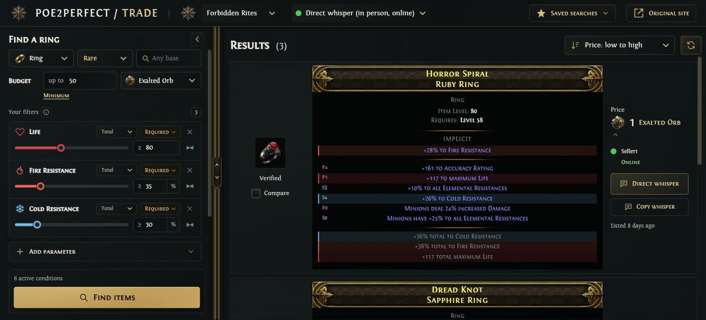
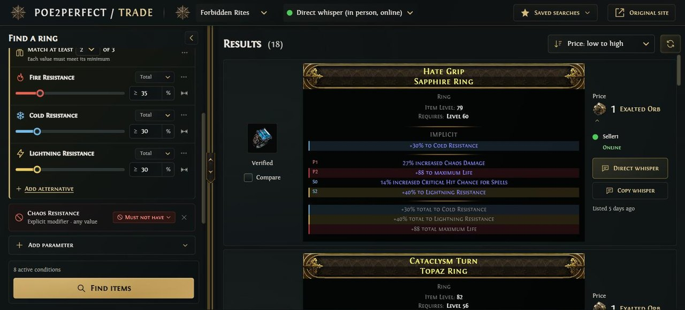
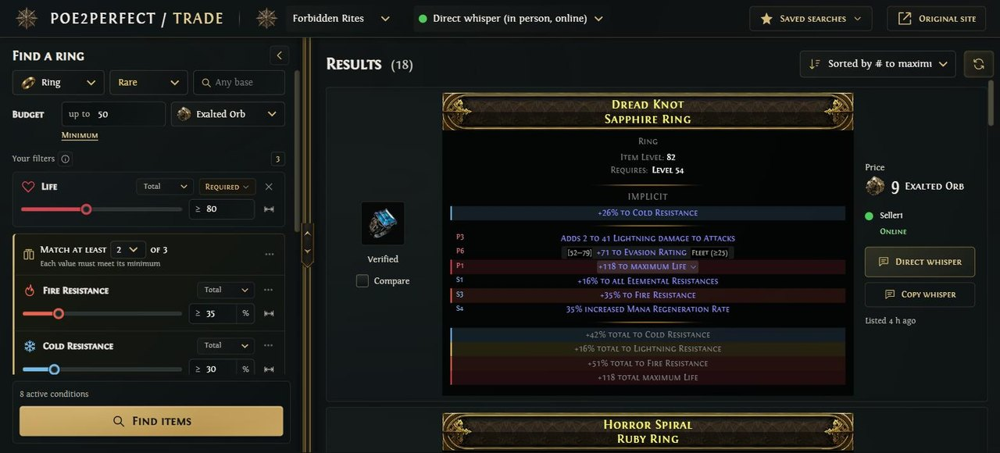
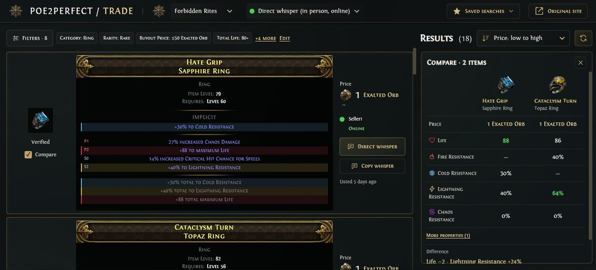
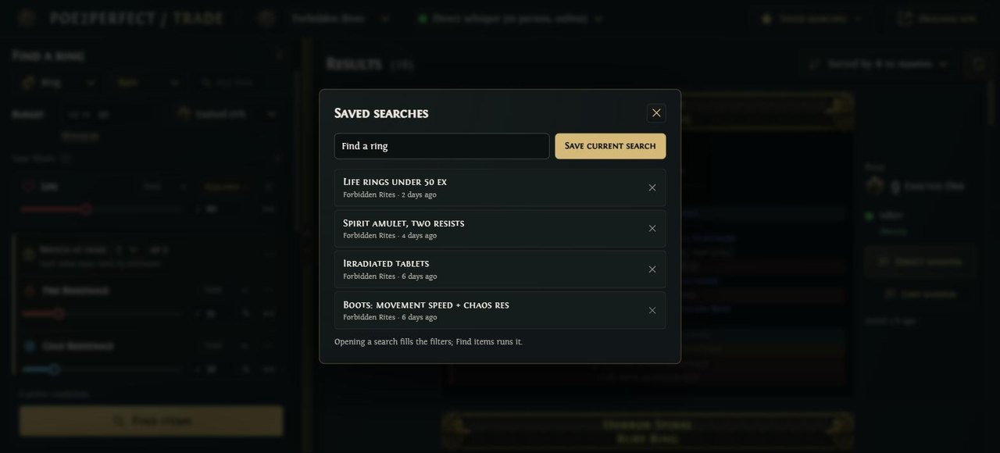
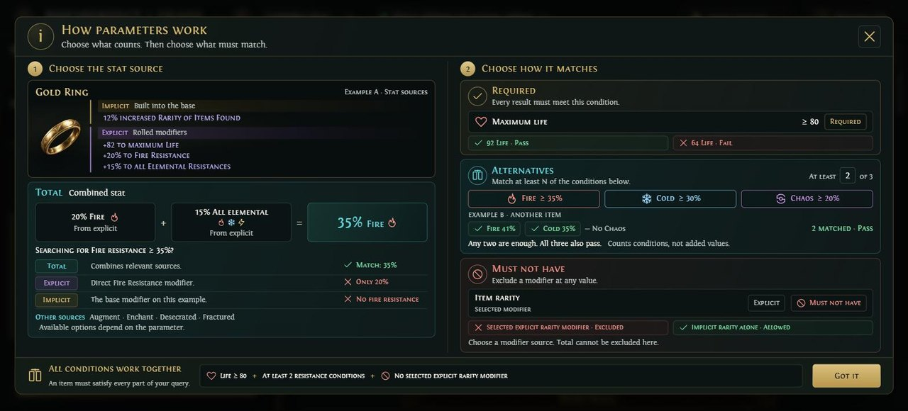

# poe2perfect trade

**A cleaner workspace for the Path of Exile 2 trade site.**

The trade search page turns into two panes: what you are looking for on the left, the listings on the right, with the
site's own item cards. Every search runs when you ask for it, and never on its own.

[](LICENSE)



## What does it do?

- **Filters that read like the item you want.** "Find a ring": category, rarity and base in one row, a budget in a
  currency, and only the parameters you add — Life, Fire Resistance, Spirit… — each with its value, an optional
  maximum and Total, Explicit or Implicit to choose from.
- **Either, or — and never this.** Make parameters alternatives ("Match at least 1 of 3") or exclude one (Must not
  have), right from its card; the site's rarer filters wait under More filters.
- **Add parameter knows the item.** One search over the trade stats, popular and recent first, with what the chosen
  item can actually have kept apart from what it cannot.
- **The site's item cards, as the site shows them.** Rarity frames, sockets with their runes on the icon, mod tiers,
  roll ranges on hover, DPS and base percentile — and the parameters you searched for marked in their colour.
- **Sort by clicking.** Click a mod, a property or a requirement on a card to sort the results by it, or the price to
  sort by price. The next listings load as you scroll.
- **Compare two listings** side by side: price, the parameters you searched for, and every other property.
- **Your searches stay yours.** Save searches by name; Back and Forward walk your searches; filters you changed but
  did not search yet survive a reload.
- **Trade from the list.** Direct whisper, Travel to hideout or copy the whisper — one click, only when you press it.
- **The original is one click away** — with your unsearched changes, if you have any.

## Features

### Either, or — and never this

Any parameter can be required, joined into alternatives ("Match at least 2 of 3") or excluded (Must not have) from
its own menu. Each has its colour and icon, a slider with an optional maximum, and Total, Explicit or Implicit.



### The site's own item cards

Listings look as the trade site draws them — frames, sockets, mod tiers — with the stats you searched for marked in
their colour and roll ranges on hover. Click any line of a card to sort the results by it, or the price to sort by
price; the next listings load as you scroll.



### Compare two listings

Tick Compare on two listings to see their price, the searched stats and every other property side by side, with the
difference.



### And also

- **Saved searches** by name; Back and Forward walk your searches; unsearched changes survive a reload.
- **How parameters work**: a built-in guide to stat sources (Total, Explicit, Implicit) and the three ways to match.





## Installation

The extension is on its way to the Chrome Web Store and Firefox Add-ons. Until then, take the latest build from
[Releases](https://github.com/ReSenpai/poe2perfect-trade/releases):

- **Chrome** (and Edge, Brave, Opera): download `poe2perfect-trade-<version>-chrome.zip`, unzip it, open
  `chrome://extensions`, turn on **Developer mode**, click **Load unpacked** and pick the unzipped folder.
- **Firefox** (140 or newer): download `poe2perfect-trade-<version>-firefox.xpi` (signed by Mozilla), open
  `about:addons` → ⚙ → **Install Add-on From File** and pick it. If you install it straight from Firefox's download
  prompt instead, the extension may only start once you open `about:addons` (or confirm the "added" notification).

Then open any search on [the PoE 2 trade site](https://www.pathofexile.com/trade2/search/poe2). Searching works
whether or not you are signed in; whispers and travel need you signed in, as on the site.

## Searches and the rate limit

The trade site allows only a few searches a minute, and a lockout also blocks your own trading. The extension makes
one search per **Find items**, shows the results of a search you opened before again without asking the site, and
never repeats a search by itself. When the site says to wait, the button counts down instead of trying again.

## What adapts to the item, and what does not

Which parameters an item can have comes from the game's data (repoe-fork), shipped with the extension and rebuilt
after a game patch. It covers weapons, armour, shields, bucklers, foci, quivers, jewellery, jewels, flasks, charms,
waystones, tablets and relics. For other kinds of items (gems, currency, fragments, augments…) every parameter stays
available and is marked "Availability not verified" rather than hidden. The slider's scale is only a guide for
typing: a value above it is kept, not cut.

## Feedback

Found a bug or have an idea? [Open an issue](https://github.com/ReSenpai/poe2perfect-trade/issues). The link of the
search you were on helps a lot — it holds only the filters, nothing about you.

## ☕ Support the project

poe2perfect trade is a free, open-source browser extension. It is licensed under GPL-3.0 and costs nothing to use.

If it turned out useful and you would like to support further development, you can donate voluntarily:

**[☕ Support on Boosty](https://boosty.to/resenpai)**

Support is voluntary. It does not unlock features, access to the extension or any other advantages.

## Privacy and permissions

The extension runs only on the trade site, talks only to it and keeps its working data in your browser.
See [PRIVACY.md](PRIVACY.md).

- Permission: `storage` only (layout, the last 5 searches' results, saved searches, an unsearched draft, the site's
  reference data).
- Runs on `https://www.pathofexile.com/trade2/*`.

Unofficial, not affiliated with Grinding Gear Games. Path of Exile is a trademark of Grinding Gear Games; listings,
item cards and images come from pathofexile.com at run time and belong to their owners.

## License

poe2perfect trade is free software, released under the [GNU General Public License v3.0 or later](LICENSE).
You may use, study, share and change it; if you distribute a modified version, it must stay under the GPL with its
source code available. Copyright (C) 2026 ReSenpai.

The name "poe2perfect trade" and its logo are not covered by the license: forks need their own name and logo.
Third-party components, the game data and their licenses are listed in [NOTICE](NOTICE).

## Contributing

See [CONTRIBUTING.md](CONTRIBUTING.md). In short: tests first, English UI strings, gentle on the trade site's rate
limits, and contributions are licensed under the GPL like the rest of the project. Changes between versions are
listed in [CHANGELOG.md](CHANGELOG.md); security issues go through [SECURITY.md](SECURITY.md).

## Development

```sh
npm install
npm run dev              # Chrome dev build in .output/chrome-mv3-dev (load it unpacked)
npm run dev:firefox      # Firefox dev build (about:debugging → Load Temporary Add-on)
npm test                 # Vitest
npm run typecheck
npm run build            # production builds in .output/chrome-mv3 …
npm run build:firefox    # … and .output/firefox-mv3
npm run zip              # .output/poe2perfect-trade-<version>-chrome.zip
npm run zip:firefox      # the Firefox zip and the sources zip for addons.mozilla.org
```

Stack: WXT, Preact, TypeScript, Vitest with happy-dom. How the code is laid out and what is known about the trade
API: [docs/ARCHITECTURE.md](docs/ARCHITECTURE.md). After a game patch,
`node --experimental-strip-types scripts/build-base-stats.ts` rebuilds `public/data/base-stats.json`.

## About

Made by [ReSenpai](https://github.com/ReSenpai). Sister project:
[poe2perfect](https://github.com/ReSenpai/poe2perfect), a better way to read PoE 2 builds on Mobalytics.
